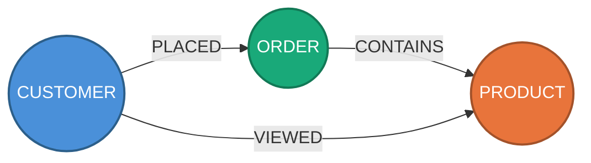

# Oracle Graph DBA Advisor

A **system prompt + SQL templates + knowledge base** that turns any MCP-compatible LLM into an Oracle Property Graph (SQL/PGQ) performance advisor for Oracle Database 23ai and 26ai.

Connects via the **ADB MCP Server** (fully managed, zero install) or **SQLcl MCP Server** (local, any Oracle 23ai/26ai).

---

## What It Does

### Design a new graph from scratch (Consultive Mode)

```
You:     "I have orders, customers and products. Would a graph help
          me find customers who buy the same things?"

Advisor: 1. Asks about your domain, entities, relationships, and business questions
         2. Assesses whether a graph model fits (or if relational is enough)
         3. Identifies vertices and edges from your existing tables
         4. Generates a visual Mermaid diagram of the proposed graph (optional)
         5. Iterates on the diagram with you until you approve
         6. Proposes CREATE PROPERTY GRAPH DDL
         7. Writes starter GRAPH_TABLE queries for your business questions
         8. Proposes initial indexes based on the query patterns
         9. Flags SQL/PGQ limitations (and whether PGX is needed)
```

#### Visual graph preview

Before generating any DDL, the advisor can produce a **Mermaid diagram** so you see the proposed graph — vertices, edges, and cardinality — and iterate on it conversationally ("add this node", "remove that edge") before committing to code.

Each vertex type gets a distinct color for quick identification:



> **To view diagrams locally**: install the VS Code extension `bierner.markdown-mermaid` (`Ctrl+Shift+X` → search → Install), then open the `.md` file with `Ctrl+K V` (split preview). GitHub also renders Mermaid natively.

### Optimize an existing graph workload

```
You:     "Analyze my graph workload and tell me what's slow and why"

Advisor: 0. Checks database health (CPU, I/O, memory, tablespace, Auto Indexing)
         1. Discovers property graphs, tables, volumes, indexes
         2. Finds the most expensive graph queries by elapsed time
         3. Reads execution plans, identifies bottlenecks
         4. Analyzes selectivity to quantify index benefit
         5. Tests improvements with invisible indexes before committing
         6. Recommends indexes (DDL + rollback), deduplicates with Auto Indexing
         7. Generates scaled data and re-tests to validate at 2X/5X/10X volume
```

The advisor follows a **simplicity-first philosophy**: a property graph is just node tables and edge tables. Index the FKs, index the filters if needed, and stop. Advanced strategies only with measured evidence.

---

## Key Capabilities

| Capability | Description |
|---|---|
| **8-phase methodology** | Health Check → Discovery → Identify → Deep Dive → Selectivity → Simulate → Recommend → Scale Test |
| **Visual graph modeling** | Generates Mermaid diagrams with color-coded vertices for design review before DDL |
| **40+ SQL templates** | Pre-built, tested diagnostic queries for Oracle 23ai/26ai graph workloads |
| **GRAPH_TABLE awareness** | Knows it expands to relational joins — traces TABLE ACCESS / HASH JOIN back to graph hops |
| **P0-P4 index strategy** | PK → FK → filter → composite → advanced. Stops at the lowest level that solves the problem |
| **Auto Indexing integration** | Checks ADB Auto Indexing status, deduplicates with auto-created indexes, recommends composites Auto Indexing can't create |
| **9 anti-patterns** | Missing stats, cartesian explosions, SYSTIMESTAMP type mismatch, VERTEX_ID overhead, co-view scaling, and more |
| **Elapsed-time evaluation** | Always measures actual elapsed time — never evaluates by optimizer cost |
| **Production guard** | Read-only by default, never executes DDL/DML or changes configuration without explicit approval |
| **Scale testing** | Generates scaled data (2X/5X/10X) and re-tests to validate that recommendations hold at volume |
| **Persistent memory** | Remembers schemas, past recommendations, and outcomes across sessions *(planned — see Roadmap)* |

---

## Architecture

```
┌──────────────────────────────────────────┐
│           MCP-compatible LLM             │
│                                          │
│  SYSTEM_PROMPT.md (auto-loaded)          │
│  sql-templates/  (diagnostic queries)    │
│  knowledge/      (patterns & rules)      │
│                                          │
└────────────────┬─────────────────────────┘
                 │ MCP Protocol
                 ▼
    ┌──── Primary ────┐  ┌── Alternative ──┐
    │  ADB MCP Server │  │  SQLcl MCP      │
    │  (fully managed,│  │  (local,        │
    │   in-database)  │  │   any Oracle)   │
    └────────┬────────┘  └───────┬─────────┘
             │                   │
             ▼                   ▼
    ┌────────────────────────────────┐
    │   Oracle Database 23ai / 26ai  │
    └────────────────────────────────┘
```

Uses AWR/ASH when available for historical trends. Falls back to `V$SQL` + `USER_*` views automatically on Always Free tier.

---

## Quick Start

### Option A: ADB Serverless (recommended — zero install)

1. Enable MCP on your ADB (OCI Console → free-form tag):
   ```
   Tag: adb$feature → {"name":"mcp_server","enable":true}
   ```

2. Register the SQL tool — connect to ADB and run:
   ```sql
   BEGIN
     DBMS_CLOUD_AI_AGENT.CREATE_TOOL(
       tool_name  => 'RUN_SQL',
       attributes => '{"instruction": "Execute a read-only SQL query.",
          "function": "RUN_SQL",
          "tool_inputs": [
            {"name":"QUERY","description":"SELECT SQL statement without trailing semicolon."},
            {"name":"OFFSET","description":"Pagination offset (default 0)."},
            {"name":"LIMIT","description":"Max rows to return (default 100)."}
          ]}'
     );
   END;
   /
   ```

3. Configure your MCP client:
   ```json
   {
     "mcpServers": {
       "oracle-graph-advisor": {
         "command": "npx",
         "args": ["-y", "mcp-remote",
           "https://dataaccess.adb.<region>.oraclecloudapps.com/adb/mcp/v1/databases/<ocid>"],
         "transport": "streamable-http"
       }
     }
   }
   ```

4. Start a conversation — the system prompt loads automatically.

> Full details: `clients/adb-mcp-setup.md`

### Option B: SQLcl local (any Oracle 23ai/26ai)

1. Add SQLcl as MCP server:
   ```json
   {
     "mcpServers": {
       "sqlcl": {
         "command": "/path/to/sqlcl/bin/sql",
         "args": ["-mcp"]
       }
     }
   }
   ```

2. Start a conversation.

> Full details: `clients/README.md`

---

## Two Operating Modes

### Consultive Mode — Design new graphs

For users asking "would a graph help for X?" or "how should I model Y?". The advisor:

1. **Assesses** if a graph model fits the use case (vs. staying relational)
2. **Proposes** a visual model (Mermaid diagram) for review
3. **Iterates** on the diagram based on feedback
4. **Generates** DDL, starter queries, and index strategy

No database connection required — the advisor works from the user's description alone. If existing tables are available and connected, it can inspect them to identify vertices and edges automatically.

The advisor never creates objects or executes DDL without explicit approval — it produces scripts and recommendations.

### Diagnostic Mode — Optimize existing graphs

For users with a running graph workload that needs tuning. The advisor runs the 8-phase methodology: health check, discovery, identification, deep dive, selectivity analysis, simulation with invisible indexes, recommendations, and scale testing.

---

## What the Advisor Knows

### Indexing (simplicity-first)

| Priority | What | When |
|----------|------|------|
| **P0** | PK indexes | Always (Oracle creates automatically — just verify) |
| **P1** | Edge FK indexes (source_key, destination_key) | Always — the #1 gap in most graph deployments |
| **P2** | Filter indexes | Only if EXPLAIN PLAN shows full scan + selectivity < 5% |
| **P3** | Composite (filter + FK) | Only if both columns appear in the same expensive plan |
| **P4** | Advanced (partitioning, IOT, bitmap) | Only at scale (>10M edges) with measured problems |

Most graphs need only P0 + P1. Auto Indexing on ADB handles additional single-column filters reactively — the advisor focuses on FK indexes (proactive) and graph-aware composites (which Auto Indexing can't create).

### Oracle Internals

- **GRAPH_TABLE translation** — reads execution plans as relational join trees
- **SQL/PGQ feature matrix** — variable-length paths `{n,m}`, ONE ROW PER, JSON properties
- **CBO behavior** — predicate pushdown, join order, adaptive plans
- **AWR/ASH** — historical trends and P90/P99 when available

### Domain Patterns

14+ pre-built graph query patterns across fraud detection, social network, supply chain, and e-commerce — each with expected plan shape, index strategy, and anti-patterns.

### Anti-Patterns (9 actively flagged)

Missing DBMS_STATS, over-indexing INSERT-heavy edge tables, unconstrained multi-hop cartesian explosions, SYSTIMESTAMP type mismatch preventing index use, VERTEX_ID/EDGE_ID client overhead, co-view fan-out scaling, and more.

---

## SQL Templates

40+ templates in `sql-templates/`, selected and parameterized automatically:

| File | Phase | Templates |
|------|-------|-----------|
| `00-health-check.sql` | Health Check + Auto Indexing | HEALTH-00 to -10c |
| `01-discovery.sql` | Discovery | DISCOVERY-01 to -06 |
| `02-identify.sql` | Identify | IDENTIFY-01 to -05 |
| `03-analyze.sql` | Deep Dive | ANALYZE-01 to -05 |
| `04-selectivity-and-simulate.sql` | Selectivity + Simulate | SELECTIVITY-01 to -04, SIMULATE-01 to -05 |
| `05-utilities.sql` | Utilities | UTIL-01 to -09 |

---

## Knowledge Base

| Directory | Content | Status |
|-----------|---------|--------|
| `graph-patterns/` | Fraud detection, social network, supply chain, use case assessment | Active |
| `graph-design/` | Modeling checklist (8 rules), physical design, query best practices | Active |
| `optimization-rules/` | Advanced indexing, Auto Indexing + graphs | Active |
| `oracle-internals/` | CBO behavior, SQL/PGQ feature matrix, PGX vs SQL/PGQ | Active |

Knowledge files include version metadata (`verified_version`, `last_verified`). The advisor flags when your DB version is newer than the knowledge. See `knowledge/FRESHNESS.md`.

---

## Client Support

| Client | MCP Transport | System Prompt |
|--------|---------------|---------------|
| **Any client (ADB native)** | HTTPS endpoint | Same as below per client |
| **Claude Code** | `.mcp.json` | `CLAUDE.md` (auto-loaded) |
| **Claude Desktop** | Manual config | Create Project → add `SYSTEM_PROMPT.md` |
| **VS Code + Copilot** | `.vscode/mcp.json` | `.github/copilot-instructions.md` |
| **Cline** | MCP settings | `.clinerules` |
| **Cursor** | MCP settings | `.cursor/rules/oracle-graph-dba.mdc` |

Minimum model: 30B+ parameters. Tested with Claude Sonnet/Opus, GPT-4o, Gemini Pro, Qwen2.5-72B, Llama-3.1-70B.

---

## Sample Workloads

| Workload | Description | Scripts |
|----------|-------------|---------|
| `workload/fraud/` | Fraud detection — 6 vertex types, 11 edge types, configurable scale | 00-05 |
| `workload/newfraud/` | Updated fraud detection variant | 00-05 |
| `workload/catalog_compat/` | Catalog compatibility testing | 00-05 |
| `workload/demo/` | End-to-end guided demo (~45 min) | Demo script + prompt |

Each workload includes schema creation, graph definition, data generation, query set, and automated workload runner.

---

## Project Structure

```
oracle-graph-dba-advisor/
├── SYSTEM_PROMPT.md                       # Advisor brain (methodology + knowledge)
├── SKILL.md                               # Skill manifest (capabilities + I/O)
├── CLAUDE.md                              # Claude Code auto-loader
├── .mcp.json                              # Claude Code MCP config
├── config/
│   └── production-guard.yaml              # Production detection rules (customize)
├── clients/                               # Setup guides per MCP client
│   ├── adb-mcp-setup.md                   # ADB native MCP (zero install)
│   └── README.md                          # SQLcl MCP + client configs
├── sql-templates/                         # 40+ diagnostic SQL templates (6 files)
├── knowledge/                             # Patterns, rules, Oracle internals
│   ├── graph-patterns/                    # Domain patterns + use case assessment
│   ├── graph-design/                      # Modeling, physical design, query practices
│   ├── optimization-rules/                # Advanced + auto indexing strategies
│   ├── oracle-internals/                  # CBO, SQL/PGQ features, PGX vs SQL/PGQ
│   └── rag/                               # [Planned] RAG with vectorized Oracle docs
├── memory/                                # [Planned] Persistent state across sessions
│   ├── _templates/                        # Schema snapshot, recommendation log
│   ├── shared/                            # User preferences, learned patterns
│   └── backends/                          # [Planned] Oracle ADB centralized memory
├── docs/                                  # Generated diagrams (Mermaid models)
├── agent/                                 # [Planned] Autonomous agent workflows
│   └── n8n/                               # n8n templates (chat, healthcheck, deploy)
└── workload/                              # Sample graph workloads
    ├── fraud/                             # Fraud detection (primary)
    ├── newfraud/                           # Fraud detection (variant)
    ├── catalog_compat/                    # Catalog compatibility
    └── demo/                              # End-to-end demo
```

---

## Extending

**New graph patterns** — Add `.md` files to `knowledge/graph-patterns/`. The advisor picks them up automatically.

**Custom SQL templates** — Add `.sql` files to `sql-templates/` and reference in `SYSTEM_PROMPT.md`.

---

## Roadmap

| Feature | Directory | Status | Description |
|---------|-----------|--------|-------------|
| **RAG layer** | `knowledge/rag/` | Planned | Vectorized Oracle docs + custom docs for deep retrieval (semantic search via OracleVS or local ChromaDB) |
| **Persistent memory** | `memory/` | Planned | File-based memory for schema snapshots, recommendation history, learned patterns across sessions |
| **Centralized memory** | `memory/backends/` | Planned | Oracle ADB as shared memory backend with vector search, multi-tenancy (VPD), and audit trail |
| **Autonomous agent** | `agent/n8n/` | Planned | n8n workflow templates for automated health checks, post-deploy analysis, and chat interface |

Design docs for each feature are already in their respective directories.

---

## Credits

Built on [Oracle SQLcl MCP Server](https://docs.oracle.com/en/database/oracle/sql-developer-command-line/) · Oracle Database 23ai/26ai · [SQL/PGQ (ISO SQL:2023)](https://blogs.oracle.com/database/property-graphs-in-oracle-database-23ai-the-sql-pgq-standard)
