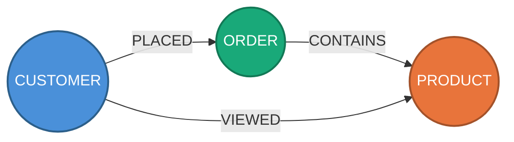

# Oracle Graph DBA Advisor

A **system prompt + SQL templates + knowledge base** that turns any MCP-compatible LLM into an Oracle Property Graph (SQL/PGQ) performance advisor for Oracle Database 23ai and 26ai.

The current productive path is **Diagnostic Mode** for existing graph workloads,
using **ADB Native MCP** and a controlled read-only SQL tool. Consultive graph
design remains available, but is secondary while Diagnostic Mode is hardened for
customer use.

---

## What It Does

### Diagnostic Mode - production workload analysis

```
You:     "Analyze my graph workload and tell me what's slow and why"

Advisor: 0. Checks safety posture and stays read-only by default
         1. Builds a health baseline from database performance views
         2. Discovers graph objects, owners, tables, indexes, and stats
         3. Finds expensive SQL/PGQ workload from V$SQL and AWR/ASH
         4. Reads execution plans and identifies graph-specific bottlenecks
         5. Explains root cause with SQL_ID, plan, wait, and object evidence
         6. Produces DBA-ready recommendations with DDL and rollback text
```

Diagnostic Mode is the primary customer-facing skill path. It is designed for
admins and DBAs who already have an Oracle property graph workload and need a
repeatable, evidence-backed performance review without letting the LLM mutate
the database.

### Secondary: design a new graph from scratch (Consultive Mode)

```
You:     "I have orders, customers and products. Would a graph help
          me find customers who buy the same things?"

Advisor: 1. Asks about your domain, entities, relationships, and business questions
         2. Assesses whether a graph model fits (or if relational is enough)
         3. Identifies vertices and edges from your existing tables
         4. Generates a visual Mermaid diagram of the proposed graph (optional)
         5. Iterates on the diagram with you until you approve
         6. Proposes CREATE PROPERTY GRAPH DDL
         7. Writes starter GRAPH_TABLE queries for your business questions
         8. Proposes initial indexes based on the query patterns
         9. Flags SQL/PGQ limitations (and whether PGX is needed)
```

#### Visual graph preview

Before generating any DDL, the advisor can produce a **Mermaid diagram** so you see the proposed graph — vertices, edges, and cardinality — and iterate on it conversationally ("add this node", "remove that edge") before committing to code.

Each vertex type gets a distinct color for quick identification:



> **To view diagrams locally**: install the VS Code extension `bierner.markdown-mermaid` (`Ctrl+Shift+X` → search → Install), then open the `.md` file with `Ctrl+K V` (split preview). GitHub also renders Mermaid natively.

### Diagnostic methodology details

```
You:     "Analyze my graph workload and tell me what's slow and why"

Advisor: 0. Checks database health (CPU, I/O, memory, tablespace, Auto Indexing)
         1. Builds a technical catalog of property graphs, owners, tables, indexes, and stats
         2. Finds the most expensive graph queries by elapsed time
         3. Reads execution plans, identifies bottlenecks
         4. Analyzes selectivity to quantify index benefit
         5. Tests improvements with invisible indexes before committing
         6. Recommends indexes (DDL + rollback), deduplicates with Auto Indexing
         7. Generates scaled data and re-tests to validate at 2X/5X/10X volume
```

The advisor follows a **simplicity-first philosophy**: a property graph is just node tables and edge tables. Index the FKs, index the filters if needed, and stop. Advanced strategies only with measured evidence.

In **Graph DBA mode**, the skill does not need deep business context to start. Its first job is to inventory the property graphs in the database and then diagnose workload behavior from a DBA perspective: waits, plans, hotspots, stale stats, and missing indexes.

---

## Key Capabilities

| Capability | Description |
|---|---|
| **8-phase methodology** | Health Check → Discovery → Identify → Deep Dive → Selectivity → Simulate → Recommend → Scale Test |
| **Visual graph modeling** | Generates Mermaid diagrams with color-coded vertices for design review before DDL |
| **50+ SQL templates** | Pre-built, tested diagnostic queries for Oracle 23ai/26ai graph workloads |
| **GRAPH_TABLE awareness** | Knows it expands to relational joins — traces TABLE ACCESS / HASH JOIN back to graph hops |
| **P0-P4 index strategy** | PK → FK → filter → composite → advanced. Stops at the lowest level that solves the problem |
| **Auto Indexing integration** | Checks ADB Auto Indexing status, deduplicates with auto-created indexes, recommends composites Auto Indexing can't create |
| **9 anti-patterns** | Missing stats, cartesian explosions, SYSTIMESTAMP type mismatch, VERTEX_ID overhead, co-view scaling, and more |
| **Elapsed-time evaluation** | Always measures actual elapsed time — never evaluates by optimizer cost |
| **Production guard** | Read-only by default, never executes DDL/DML or changes configuration without explicit approval |
| **Scale testing** | Generates scaled data (2X/5X/10X) and re-tests to validate that recommendations hold at volume |
| **Persistent memory** | Remembers schemas, past recommendations, and outcomes across sessions *(planned — see Roadmap)* |

---

## Architecture

For the current Diagnostic Mode implementation on ADB Serverless, the productive
path is ADB Native MCP plus a read-only SQL tool. The local SQLcl path remains a
secondary compatibility option for environments where ADB Native MCP is not the
target.

```
┌──────────────────────────────────────────┐
│           MCP-compatible LLM             │
│                                          │
│  SYSTEM_PROMPT.md (auto-loaded)          │
│  sql-templates/  (diagnostic queries)    │
│  knowledge/      (patterns & rules)      │
│                                          │
└────────────────┬─────────────────────────┘
                 │ MCP Protocol
                 ▼
    ┌── Default Path ─┐  ┌── Compatible ───┐
    │   SQLcl MCP     │  │ ADB Native MCP  │
    │   (local, any   │  │ (ADB Serverless │
    │    Oracle)      │  │  + run-sql)     │
    └────────┬────────┘  └───────┬─────────┘
             │                   │
             ▼                   ▼
    ┌────────────────────────────────┐
    │   Oracle Database 23ai / 26ai  │
    └────────────────────────────────┘
```

Diagnostic Mode uses AWR/ASH for historical trends and `V$SQL` for current
workload evidence.

---

## Diagnostic Mode Client Requirements

Use this checklist when implementing the productive Diagnostic Mode skill for a
customer environment.

### Environment

- Autonomous Database Serverless 23ai or 26ai.
- ADB Native MCP enabled on the target database.
- OAuth or bearer-token authentication for the MCP client.
- A dedicated technical database user for the skill, not a personal user and not `ADMIN`.
- Target schema, graph name, workload window, and environment classification.
- AWR/ASH available for historical diagnosis.

### Runtime MCP Tool

The skill needs one read-only SQL execution tool exposed through ADB Native MCP.
The recommended contract is `RUN_SQL`.

If the client already has an approved read-only SQL MCP tool in a low-risk test
or production-clone environment, the skill can be mapped to that tool after
validating that it cannot perform writes. For production-style use, prefer the
hardened `RUN_SQL` implementation in `clients/adb-native-run-sql-readonly.sql`.

Recommended tool lifecycle:

1. A DBA/installer creates or replaces `RUN_SQL` in the diagnostic user's schema.
2. The MCP tool is registered for the runtime identity that will authenticate to ADB Native MCP.
3. `tools/list` is validated to expose only the intended read-only SQL tool.
4. A write rejection test is executed before using the skill.

Grant `CREATE PROCEDURE` to the diagnostic user only if that same user must
self-install or self-update the MCP tool. It is not a runtime privilege for the
skill.

### Runtime Grants

```sql
GRANT CREATE SESSION TO graph_diag_user;
GRANT EXECUTE ON DBMS_XPLAN TO graph_diag_user;

GRANT SELECT ON SYS.V_$SQL TO graph_diag_user;
GRANT SELECT ON SYS.V_$SQLSTATS TO graph_diag_user;
GRANT SELECT ON SYS.V_$SQLAREA_PLAN_HASH TO graph_diag_user;
GRANT SELECT ON SYS.V_$SQL_PLAN TO graph_diag_user;
GRANT SELECT ON SYS.V_$SQL_PLAN_STATISTICS_ALL TO graph_diag_user;
GRANT SELECT ON SYS.V_$SQL_SHARED_CURSOR TO graph_diag_user;
GRANT SELECT ON SYS.V_$SQLTEXT TO graph_diag_user;
GRANT SELECT ON SYS.V_$PARAMETER TO graph_diag_user;
GRANT SELECT ON SYS.V_$SESSION TO graph_diag_user;
GRANT SELECT ON SYS.V_$ACTIVE_SESSION_HISTORY TO graph_diag_user;
GRANT SELECT ON SYS.V_$SYSMETRIC_HISTORY TO graph_diag_user;
GRANT SELECT ON SYS.V_$SYSTEM_EVENT TO graph_diag_user;
GRANT SELECT ON SYS.V_$SGASTAT TO graph_diag_user;
GRANT SELECT ON SYS.V_$PGASTAT TO graph_diag_user;

GRANT SELECT ON DBA_HIST_SNAPSHOT TO graph_diag_user;
GRANT SELECT ON DBA_HIST_SYSMETRIC_SUMMARY TO graph_diag_user;
GRANT SELECT ON DBA_HIST_SYSTEM_EVENT TO graph_diag_user;
GRANT SELECT ON DBA_HIST_PGASTAT TO graph_diag_user;
GRANT SELECT ON DBA_HIST_ACTIVE_SESS_HISTORY TO graph_diag_user;

GRANT SELECT ON DBA_TABLESPACE_USAGE_METRICS TO graph_diag_user;
GRANT SELECT ON DBA_TEMP_FREE_SPACE TO graph_diag_user;
GRANT SELECT ON DBA_AUTO_INDEX_CONFIG TO graph_diag_user;
GRANT SELECT ON DBA_AUTO_INDEX_IND_ACTIONS TO graph_diag_user;
GRANT SELECT ON DBA_AUTO_INDEX_EXECUTIONS TO graph_diag_user;
```

---

## Quick Start

For the productive Diagnostic Mode path, use **ADB Native MCP** with the read-only
SQL tool contract described above.

For the client-facing **Graph DBA workload-analysis** requirements, use:

- `docs/graph-dba-workload-mode-requirements.md`

### ADB Serverless Diagnostic Mode

Minimum operational baseline for the diagnostic mode:

- one dedicated technical schema per target database
- minimum diagnostic grants on that schema
- MCP enabled on the ADB
- MCP authentication via OAuth or bearer token
- one read-only SQL MCP tool, recommended contract `RUN_SQL`

Reference docs:

- `docs/diagnostic-mode-minimum-prereqs.md`
- `docs/graph-dba-workload-mode-requirements.md`
- `clients/adb-mcp-setup.md`
- `docs/native-mcp-packaged-playbooks.md`

1. Enable MCP on your ADB (OCI Console → free-form tag):
   ```
   Tag: adb$feature → {"name":"mcp_server","enable":true}
   ```

2. Register the read-only SQL tool:
   Prefer `clients/adb-native-run-sql-readonly.sql` when database-side
   guardrails are required. A DBA/installer can create the backing function in
   the diagnostic user's schema; the diagnostic user does not need
   `CREATE PROCEDURE` at runtime.

3. Configure your MCP client:
   ```json
   {
     "mcpServers": {
       "oracle-graph-advisor": {
         "command": "npx",
         "args": ["-y", "mcp-remote",
           "https://dataaccess.adb.<region>.oraclecloudapps.com/adb/mcp/v1/databases/<ocid>"],
         "transport": "streamable-http"
       }
     }
   }
   ```

4. Start a conversation — the system prompt loads automatically.

> Full details: `clients/adb-mcp-setup.md`
> Practical minimum prerequisites: `docs/diagnostic-mode-minimum-prereqs.md`

### Secondary local compatibility path: SQLcl MCP

For ADB Dedicated, Base DB, on-prem, Free tier, or any Oracle 23ai/26ai where the native MCP endpoint is not available.

#### Prerequisites

| Requirement | Version | Download |
|-------------|---------|----------|
| **Java (JDK)** | 17 or higher | [Oracle JDK](https://www.oracle.com/java/technologies/downloads/) or OpenJDK |
| **Oracle SQLcl** | 25.1+ | [SQLcl Downloads](https://www.oracle.com/database/sqldeveloper/technologies/sqlcl/download/) |
| **Oracle Wallet** (ADB only) | — | Download from OCI Console → ADB → DB Connection → Download Wallet |

#### Step 1: Install Java

Verify Java is installed:
```bash
java -version
# Must show 17 or higher
```

If not installed, download and install JDK 17+. Ensure `JAVA_HOME` is set and `java` is in your PATH.

#### Step 2: Install SQLcl

1. Download SQLcl from [oracle.com/sqlcl](https://www.oracle.com/database/sqldeveloper/technologies/sqlcl/download/)
2. Unzip to a directory (e.g., `/opt/sqlcl` or `C:\sqlcl`)
3. Verify:
   ```bash
   /path/to/sqlcl/bin/sql -version
   ```

#### Step 3: Create a saved connection

SQLcl MCP requires a **saved connection** with stored password. Open SQLcl and create one:

**For ADB (with wallet):**
```bash
/path/to/sqlcl/bin/sql /nolog

SQL> set cloudconfig /path/to/wallet.zip
SQL> conn -save my_graph_db -savepwd admin/MyPassword123@myadb_low
```

**For on-prem / Base DB / Free tier:**
```bash
/path/to/sqlcl/bin/sql /nolog

SQL> conn -save my_graph_db -savepwd myuser/MyPassword123@hostname:1521/service_name
```

> The connection name (`my_graph_db`) is case-sensitive. You will use it later to connect via the advisor.

#### Step 4: Test the connection

```bash
/path/to/sqlcl/bin/sql my_graph_db

SQL> SELECT SYS_CONTEXT('USERENV','DB_NAME') FROM DUAL;
# Should return your database name
SQL> exit
```

#### Step 5: Configure your MCP client

Add SQLcl as an MCP server in your client's configuration:

**Claude Code** — create or edit `.mcp.json` in the project root:
```json
{
  "mcpServers": {
    "sqlcl": {
      "command": "/path/to/sqlcl/bin/sql",
      "args": ["-mcp"]
    }
  }
}
```

**If connecting to ADB**, add the wallet path:
```json
{
  "mcpServers": {
    "sqlcl": {
      "command": "/path/to/sqlcl/bin/sql",
      "args": ["-mcp"],
      "env": {
        "TNS_ADMIN": "/path/to/wallet"
      }
    }
  }
}
```

**Claude Desktop** — edit `claude_desktop_config.json` (same format as above).

**VS Code + Copilot** — add to `.vscode/mcp.json`:
```json
{
  "servers": {
    "sqlcl": {
      "command": "/path/to/sqlcl/bin/sql",
      "args": ["-mcp"]
    }
  }
}
```

#### Step 6: Connect from the advisor

Once the MCP server is running, tell the advisor to connect using your saved connection name:

```
You:     "Connect to my_graph_db"
Advisor: Uses the MCP connect tool → confirms connection → ready to analyze
```

Or use the MCP connect tool directly if your client exposes it.

> Full client-specific details: `clients/README.md`

---

## Two Operating Modes

### Diagnostic Mode - Optimize existing graphs

This is the productive path. It is for teams with a running graph workload that
needs diagnosis or tuning. The advisor runs read-only by default: safety gate,
health check, discovery, workload identification, plan evidence, selectivity
analysis, recommendations, and optional simulation only after approval.

### Secondary: Consultive Mode - Design new graphs

For users asking "would a graph help for X?" or "how should I model Y?". The advisor:

1. **Assesses** if a graph model fits the use case (vs. staying relational)
2. **Proposes** a visual model (Mermaid diagram) for review
3. **Iterates** on the diagram based on feedback
4. **Generates** DDL, starter queries, and index strategy

No database connection required — the advisor works from the user's description alone. If existing tables are available and connected, it can inspect them to identify vertices and edges automatically.

The advisor never creates objects or executes DDL without explicit approval — it produces scripts and recommendations.

### Diagnostic Mode reference

For users with a running graph workload that needs tuning. See the productive
Diagnostic Mode section above.

---

## Required Database Privileges

Each mode requires different privilege levels. Grant only what you need.

**Template note**: the shipped `USER_*` templates assume the session resolves
`CURRENT_SCHEMA` to the target graph-owning schema. A separate diagnostic user
can still be used, but it should use the owner-aware / DBA catalog path for graph
metadata.

For the ADB Native MCP production-style path, prefer one dedicated technical
user per target database plus direct read grants and a controlled read-only SQL
tool.

### Level 0: Consultive Mode — No connection required

No database privileges needed. The advisor works from the user's description to assess, design, and generate scripts.

### Level 1: Read-Only Diagnostic (recommended for production)

Analyzes graph topology, finds expensive queries, reads execution plans. **No writes.**

```sql
-- Connect as the target graph-owning schema (recommended).
-- USER_* graph dictionary views are available there by default.

-- Performance views (V$)
GRANT SELECT ON V_$SQL                 TO graph_owner;
GRANT SELECT ON V_$SQL_PLAN            TO graph_owner;
GRANT SELECT ON V_$SQL_PLAN_STATISTICS_ALL TO graph_owner;
GRANT SELECT ON V_$PARAMETER           TO graph_owner;
GRANT SELECT ON V_$SESSION             TO graph_owner;
GRANT SELECT ON V_$SYSMETRIC_HISTORY   TO graph_owner;
GRANT SELECT ON V_$SYSTEM_EVENT        TO graph_owner;
GRANT SELECT ON V_$SGASTAT             TO graph_owner;
GRANT SELECT ON V_$PGASTAT             TO graph_owner;
GRANT SELECT ON V_$VERSION             TO graph_owner;

-- Execution plan display
GRANT EXECUTE ON DBMS_XPLAN            TO graph_owner;
```

> **Note**: `USER_*` views are accessible by default to the schema owner. `GRANT SELECT ON USER_* ...` is not the intended onboarding model for this repo; connect as the owning schema instead.
> **ADB note**: on Autonomous, the V$ grants are typically issued as `GRANT SELECT ON SYS.V_$...`.

### Level 2: Read-Only + AWR/ASH

Adds historical trends, ASH evidence, and Auto Indexing status. For the current
client diagnostic implementation, AWR/ASH access is assumed available and
approved.

```sql
-- All Level 1 privileges, plus:
GRANT SELECT_CATALOG_ROLE              TO graph_owner;
-- Or grant individual DBA_ views:
GRANT SELECT ON DBA_HIST_SNAPSHOT      TO graph_owner;
GRANT SELECT ON DBA_HIST_SYSMETRIC_SUMMARY TO graph_owner;
GRANT SELECT ON DBA_HIST_SYSTEM_EVENT  TO graph_owner;
GRANT SELECT ON DBA_HIST_PGASTAT       TO graph_owner;
GRANT SELECT ON DBA_HIST_ACTIVE_SESS_HISTORY TO graph_owner;
GRANT SELECT ON DBA_TABLESPACE_USAGE_METRICS TO graph_owner;
GRANT SELECT ON DBA_AUTO_INDEX_CONFIG  TO graph_owner;
GRANT SELECT ON DBA_AUTO_INDEX_IND_ACTIONS TO graph_owner;
GRANT SELECT ON DBA_INDEX_USAGE        TO graph_owner;  -- 23ai+
```

> **ADB Native MCP note**: for stored PL/SQL tools, prefer direct grants instead
> of relying on roles because definer-rights PL/SQL does not inherit role
> privileges reliably.

### Level 3: Simulate — Test with invisible indexes

Creates invisible indexes to measure impact before committing. Session-scoped, zero risk to existing queries.

```sql
-- All Level 1 privileges, plus:
GRANT CREATE INDEX                     TO graph_owner;  -- for CREATE INDEX ... INVISIBLE
GRANT ALTER SESSION                    TO graph_owner;  -- for optimizer_use_invisible_indexes
GRANT ALTER INDEX                      TO graph_owner;  -- for VISIBLE/INVISIBLE toggle
-- Optionally:
GRANT DROP INDEX                       TO graph_owner;  -- for rollback
```

### Level 4: Full — Create schema, graph, and workload

For development/test environments where the advisor creates the full use case (tables, graph, data, indexes).

```sql
-- All Level 1-3 privileges, plus:
GRANT CREATE SESSION                   TO graph_owner;
GRANT CREATE TABLE                     TO graph_owner;
GRANT CREATE PROPERTY GRAPH            TO graph_owner;
GRANT CREATE VIEW                      TO graph_owner;
GRANT CREATE SEQUENCE                  TO graph_owner;
GRANT CREATE PROCEDURE                 TO graph_owner;
GRANT EXECUTE ON DBMS_STATS            TO graph_owner;
GRANT EXECUTE ON DBMS_RANDOM           TO graph_owner;
GRANT UNLIMITED TABLESPACE             TO graph_owner;  -- or specific quota
```

### Quick reference

| Mode | Connection | Writes | Typical use | Privilege level |
|------|-----------|--------|-------------|-----------------|
| **Consultive** | No | None | Design new graph from description | Level 0 |
| **Diagnostic (read-only)** | Yes | None | Analyze production workload | Level 1 |
| **Diagnostic + AWR** | Yes | None | Historical trends, Auto Indexing | Level 2 |
| **Diagnostic + Simulate** | Yes | Invisible indexes only | Test index recommendations | Level 3 |
| **Full (dev/test)** | Yes | DDL + DML | Build and test complete use case | Level 4 |

---

## What the Advisor Knows

### Indexing (simplicity-first)

| Priority | What | When |
|----------|------|------|
| **P0** | PK indexes | Always (Oracle creates automatically — just verify) |
| **P1** | Edge FK indexes (source_key, destination_key) | Always — the #1 gap in most graph deployments |
| **P2** | Filter indexes | Only if EXPLAIN PLAN shows full scan + selectivity < 5% |
| **P3** | Composite (filter + FK) | Only if both columns appear in the same expensive plan |
| **P4** | Advanced (partitioning, IOT, bitmap) | Only at scale (>10M edges) with measured problems |

Most graphs need only P0 + P1. Auto Indexing on ADB handles additional single-column filters reactively — the advisor focuses on FK indexes (proactive) and graph-aware composites (which Auto Indexing can't create).

### Oracle Internals

- **GRAPH_TABLE translation** — reads execution plans as relational join trees
- **SQL/PGQ feature matrix** — variable-length paths `{n,m}`, ONE ROW PER, JSON properties
- **CBO behavior** — predicate pushdown, join order, adaptive plans
- **AWR/ASH** — historical trends and P90/P99 when available

### Domain Patterns

14+ pre-built graph query patterns across fraud detection, social network, supply chain, and e-commerce — each with expected plan shape, index strategy, and anti-patterns.

### Anti-Patterns (9 actively flagged)

Missing DBMS_STATS, over-indexing INSERT-heavy edge tables, unconstrained multi-hop cartesian explosions, SYSTIMESTAMP type mismatch preventing index use, VERTEX_ID/EDGE_ID client overhead, co-view fan-out scaling, and more.

---

## SQL Templates

50+ templates in `sql-templates/`, selected and parameterized automatically:

| File | Phase | Templates |
|------|-------|-----------|
| `00-health-check.sql` | Health Check + Auto Indexing | HEALTH-00 to -10c |
| `01-discovery.sql` | Discovery | DISCOVERY-01 to -06 |
| `02-identify.sql` | Identify | IDENTIFY-01 to -05 |
| `03-analyze.sql` | Deep Dive | ANALYZE-01 to -05 |
| `04-selectivity-and-simulate.sql` | Selectivity + Simulate | SELECTIVITY-01 to -04, SIMULATE-01 to -05 |
| `05-utilities.sql` | Utilities | UTIL-01 to -09 |

---

## Knowledge Base

| Directory | Content | Status |
|-----------|---------|--------|
| `graph-patterns/` | Fraud detection, social network, supply chain, use case assessment | Active |
| `graph-design/` | Modeling checklist (8 rules), physical design, query best practices | Active |
| `optimization-rules/` | Advanced indexing, Auto Indexing + graphs | Active |
| `oracle-internals/` | CBO behavior, SQL/PGQ feature matrix, PGX vs SQL/PGQ | Active |

Knowledge files include version metadata (`verified_version`, `last_verified`). The advisor flags when your DB version is newer than the knowledge. See `knowledge/FRESHNESS.md`.

---

## Client Support

| Client | MCP Transport | System Prompt |
|--------|---------------|---------------|
| **Any client (ADB native)** | HTTPS endpoint | Same as below per client |
| **Claude Code** | `.mcp.json` | `CLAUDE.md` (auto-loaded) |
| **Claude Desktop** | Manual config | Create Project → add `SYSTEM_PROMPT.md` |
| **VS Code + Copilot** | `.vscode/mcp.json` | `.github/copilot-instructions.md` |
| **Cline** | MCP settings | `.clinerules` |
| **Cursor** | MCP settings | `.cursor/rules/oracle-graph-dba.mdc` |

Minimum model: 30B+ parameters. Tested with Claude Sonnet/Opus, GPT-4o, Gemini Pro, Qwen2.5-72B, Llama-3.1-70B.

---

## Sample Workloads

| Workload | Description | Scripts |
|----------|-------------|---------|
| `workload/fraud/` | Fraud detection — 6 vertex types, 11 edge types, configurable scale | 00-05 |
| `workload/newfraud/` | Updated fraud detection variant | 00-05 |
| `workload/catalog_compat/` | Catalog compatibility testing | 00-05 |
| `workload/demo/` | End-to-end guided demo (~45 min) | Demo script + prompt |

Each workload includes schema creation, graph definition, data generation, query set, and automated workload runner.

---

## Project Structure

```
oracle-graph-dba-advisor/
├── SYSTEM_PROMPT.md                       # Advisor brain (methodology + knowledge)
├── SKILL.md                               # Skill manifest (capabilities + I/O)
├── CLAUDE.md                              # Claude Code auto-loader
├── .mcp.json                              # Claude Code MCP config
├── config/
│   └── production-guard.yaml              # Production detection rules (customize)
├── clients/                               # Setup guides per MCP client
│   ├── adb-mcp-setup.md                   # ADB native MCP (zero install)
│   └── README.md                          # SQLcl MCP + client configs
├── sql-templates/                         # 50+ diagnostic SQL templates (6 files)
├── knowledge/                             # Patterns, rules, Oracle internals
│   ├── graph-patterns/                    # Domain patterns + use case assessment
│   ├── graph-design/                      # Modeling, physical design, query practices
│   ├── optimization-rules/                # Advanced + auto indexing strategies
│   ├── oracle-internals/                  # CBO, SQL/PGQ features, PGX vs SQL/PGQ
│   └── rag/                               # [Planned] RAG with vectorized Oracle docs
├── memory/                                # [Planned] Persistent state across sessions
│   ├── _templates/                        # Schema snapshot, recommendation log
│   ├── shared/                            # User preferences, learned patterns
│   └── backends/                          # [Planned] Oracle ADB centralized memory
├── docs/                                  # Generated diagrams (Mermaid models)
├── agent/                                 # [Planned] Autonomous agent workflows
│   └── n8n/                               # n8n templates (chat, healthcheck, deploy)
└── workload/                              # Sample graph workloads
    ├── fraud/                             # Fraud detection (primary)
    ├── newfraud/                           # Fraud detection (variant)
    ├── catalog_compat/                    # Catalog compatibility
    └── demo/                              # End-to-end demo
```

---

## Extending

**New graph patterns** — Add `.md` files to `knowledge/graph-patterns/`. The advisor picks them up automatically.

**Custom SQL templates** — Add `.sql` files to `sql-templates/` and reference in `SYSTEM_PROMPT.md`.

---

## Roadmap

| Feature | Directory | Status | Description |
|---------|-----------|--------|-------------|
| **RAG layer** | `knowledge/rag/` | Planned | Vectorized Oracle docs + custom docs for deep retrieval (semantic search via OracleVS or local ChromaDB) |
| **Persistent memory** | `memory/` | Planned | File-based memory for schema snapshots, recommendation history, learned patterns across sessions |
| **Centralized memory** | `memory/backends/` | Planned | Oracle ADB as shared memory backend with vector search, multi-tenancy (VPD), and audit trail |
| **Autonomous agent** | `agent/n8n/` | Planned | n8n workflow templates for automated health checks, post-deploy analysis, and chat interface |
| **Agent Factory governance spike** | `agent/` | Pending | Evaluate Private Agent Factory only for governance controls: RBAC, prompt guardrails, read-only tool allowlisting, audit trails, evaluation, and controlled endpoint exposure |

Design docs for each feature are already in their respective directories.

---

## Disclaimer

This is an **independent, community-driven project**. It is **not** an official Oracle product, nor is it endorsed, sponsored, or supported by Oracle Corporation. Oracle, Oracle Database, Oracle Cloud, ADB, Exadata, SQL/PGQ, PGX, and all related names and logos are **registered trademarks of Oracle Corporation** and/or its affiliates. All rights reserved. Use of these trademarks in this project is for identification purposes only and does not imply any affiliation with or endorsement by Oracle.

---

## Credits

Built on [Oracle SQLcl MCP Server](https://docs.oracle.com/en/database/oracle/sql-developer-command-line/) · Oracle Database 23ai/26ai · [SQL/PGQ (ISO SQL:2023)](https://blogs.oracle.com/database/property-graphs-in-oracle-database-23ai-the-sql-pgq-standard)
