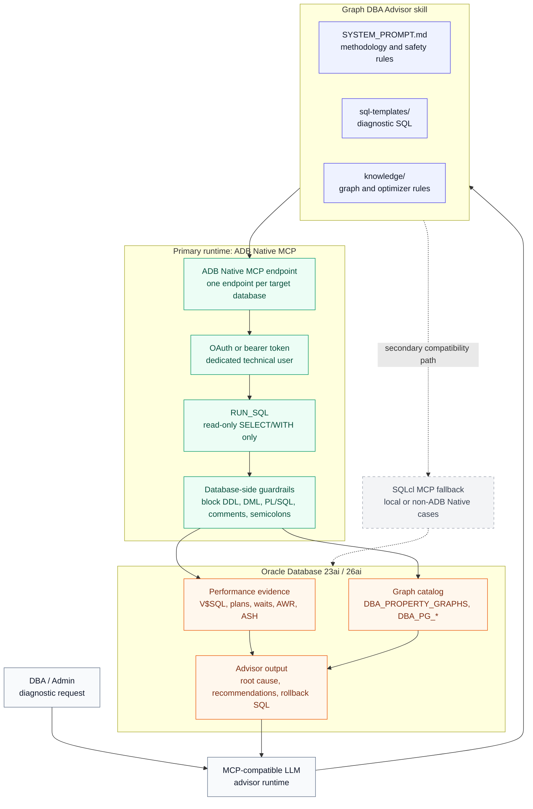

# Oracle Graph DBA Advisor

A system prompt, SQL template set, and knowledge base that turns an
MCP-compatible LLM into a read-only Oracle Property Graph performance advisor
for Oracle Database 23ai and 26ai.

The primary path is **Diagnostic Mode**: analyze an existing graph workload,
collect database evidence, explain the root cause, and produce DBA-ready
recommendations. For ADB Serverless, the preferred runtime is **ADB Native MCP**
with one controlled read-only SQL tool.

## What this does

Diagnostic Mode answers questions like:

```text
Analyze my graph workload and tell me what is slow, why it is slow, and what the DBA team should change.
```

The advisor:

1. Confirms the safety posture and stays read-only by default.
2. Builds a database health baseline from performance views.
3. Discovers property graph objects, owners, backing tables, indexes, and stats.
4. Finds expensive SQL/PGQ workload from `V$SQL`, AWR, and ASH.
5. Reads execution plans and maps relational operators back to graph hops.
6. Explains root cause with `SQL_ID`, plan, wait, and object evidence.
7. Produces recommendations with DDL, validation SQL, and rollback text.

The skill is designed for DBAs and platform teams that already have an Oracle
property graph workload and need a repeatable diagnostic workflow without giving
the LLM write access to the database.

## Current focus

| Area | Status | Notes |
|---|---|---|
| Diagnostic Mode | Primary | Customer-facing path for workload diagnosis and tuning. |
| ADB Native MCP | Preferred for ADB Serverless | No SQLcl runtime dependency; expose only approved database-side tools. |
| SQLcl MCP | Secondary fallback | Useful for local, on-prem, Base DB, ADB Dedicated, or non-ADB Native MCP cases. |
| Consultive Mode | Secondary | Design-from-description flow; kept below the diagnostic path. |
| Agent Factory governance | Roadmap | Evaluate only for governance, guardrails, auditing, and tool allowlisting. |

## Architecture



For ADB Serverless Diagnostic Mode, the runtime should expose a minimal MCP tool
surface. The recommended tool contract is `RUN_SQL`; it must accept only
read-only diagnostic SQL and reject DDL, DML, PL/SQL, comments, semicolons,
client commands, side-effect packages, and `SELECT FOR UPDATE`.

SQLcl MCP remains a compatibility path when ADB Native MCP is not the target.
It should not be required for the production ADB Serverless diagnostic skill.

## Diagnostic Mode requirements

Use this checklist to implement the Diagnostic Mode skill.

### Environment

- Autonomous Database Serverless with MCP enabled.
- Oracle Database graph workload on 23ai or 26ai.
- OAuth or bearer-token authentication for the MCP client.
- One dedicated technical database user per target database.
- No personal user and no `ADMIN` runtime identity.
- Target schema, graph name, workload window, and environment classification.
- AWR/ASH access approved for historical diagnosis.

### MCP tool contract

- Expose one read-only SQL tool through ADB Native MCP.
- Recommended tool name: `RUN_SQL`.
- Recommended implementation: [clients/adb-native-run-sql-readonly.sql](clients/adb-native-run-sql-readonly.sql).
- Validate `tools/list` so only the approved diagnostic tool is exposed.
- Run a write-rejection test before the skill is used.

Tool lifecycle:

1. A DBA or installer creates or replaces `RUN_SQL` in the diagnostic schema.
2. The MCP tool is registered for the runtime identity used by ADB Native MCP.
3. The diagnostic runtime user receives only the read grants it needs.
4. `CREATE PROCEDURE` is granted to the diagnostic user only if that same user
   must self-install or self-update the tool. It is not a runtime privilege.

### Runtime grants

Minimum session and plan access:

```sql
GRANT CREATE SESSION TO graph_diag_user;
GRANT EXECUTE ON DBMS_XPLAN TO graph_diag_user;
```

Dynamic performance views:

```sql
GRANT SELECT ON SYS.V_$SQL TO graph_diag_user;
GRANT SELECT ON SYS.V_$SQLSTATS TO graph_diag_user;
GRANT SELECT ON SYS.V_$SQLAREA_PLAN_HASH TO graph_diag_user;
GRANT SELECT ON SYS.V_$SQL_PLAN TO graph_diag_user;
GRANT SELECT ON SYS.V_$SQL_PLAN_STATISTICS_ALL TO graph_diag_user;
GRANT SELECT ON SYS.V_$SQL_SHARED_CURSOR TO graph_diag_user;
GRANT SELECT ON SYS.V_$SQLTEXT TO graph_diag_user;
GRANT SELECT ON SYS.V_$PARAMETER TO graph_diag_user;
GRANT SELECT ON SYS.V_$SESSION TO graph_diag_user;
GRANT SELECT ON SYS.V_$ACTIVE_SESSION_HISTORY TO graph_diag_user;
GRANT SELECT ON SYS.V_$SYSMETRIC_HISTORY TO graph_diag_user;
GRANT SELECT ON SYS.V_$SYSTEM_EVENT TO graph_diag_user;
GRANT SELECT ON SYS.V_$SGASTAT TO graph_diag_user;
GRANT SELECT ON SYS.V_$PGASTAT TO graph_diag_user;
```

Graph catalog and object metadata:

```sql
GRANT SELECT ON DBA_PROPERTY_GRAPHS TO graph_diag_user;
GRANT SELECT ON DBA_PG_ELEMENTS TO graph_diag_user;
GRANT SELECT ON DBA_PG_EDGE_RELATIONSHIPS TO graph_diag_user;
GRANT SELECT ON DBA_TABLES TO graph_diag_user;
GRANT SELECT ON DBA_INDEXES TO graph_diag_user;
GRANT SELECT ON DBA_IND_COLUMNS TO graph_diag_user;
GRANT SELECT ON DBA_TAB_STATISTICS TO graph_diag_user;
GRANT SELECT ON DBA_TAB_COL_STATISTICS TO graph_diag_user;
```

Health, AWR, ASH, and Auto Indexing:

```sql
GRANT SELECT ON DBA_HIST_SNAPSHOT TO graph_diag_user;
GRANT SELECT ON DBA_HIST_SYSMETRIC_SUMMARY TO graph_diag_user;
GRANT SELECT ON DBA_HIST_SYSTEM_EVENT TO graph_diag_user;
GRANT SELECT ON DBA_HIST_PGASTAT TO graph_diag_user;
GRANT SELECT ON DBA_HIST_ACTIVE_SESS_HISTORY TO graph_diag_user;

GRANT SELECT ON DBA_TABLESPACE_USAGE_METRICS TO graph_diag_user;
GRANT SELECT ON DBA_TEMP_FREE_SPACE TO graph_diag_user;
GRANT SELECT ON DBA_AUTO_INDEX_CONFIG TO graph_diag_user;
GRANT SELECT ON DBA_AUTO_INDEX_IND_ACTIONS TO graph_diag_user;
GRANT SELECT ON DBA_AUTO_INDEX_EXECUTIONS TO graph_diag_user;
```

Detailed docs:

- [docs/diagnostic-mode-minimum-prereqs.md](docs/diagnostic-mode-minimum-prereqs.md)
- [Diagnostic requirements selector](https://diegoecab.github.io/oracle-graph-dba-advisor/diagnostic-requirements-selector.html) - interactive selector for the recommended Diagnostic Mode requirements.
- [docs/graph-dba-workload-mode-requirements.md](docs/graph-dba-workload-mode-requirements.md)
- [clients/adb-mcp-setup.md](clients/adb-mcp-setup.md)
- [docs/native-mcp-packaged-playbooks.md](docs/native-mcp-packaged-playbooks.md)

## Quick start for ADB Serverless Diagnostic Mode

1. Enable ADB Native MCP on the target database.

   ```text
   Tag name:  adb$feature
   Tag value: {"name":"mcp_server","enable":true}
   ```

2. Create or choose the dedicated diagnostic user.

   Use one technical schema per target database. Do not use a personal account
   or `ADMIN` for runtime access.

3. Apply the read grants.

   Recommended: a DBA/ADMIN runs
   [clients/adb-diagnostic-grants-advisor.sql](clients/adb-diagnostic-grants-advisor.sql)
   as the baseline grant script. Alternative: the client DBA copies the grant
   list from this README and applies it manually through their change-management
   process. The skill does not grant privileges to itself.

4. Register the read-only MCP tool.

   Prefer:

   ```sql
   @clients/adb-native-run-sql-readonly.sql
   ```

   A DBA or installer can create the backing function in the diagnostic schema.
   The diagnostic user does not need `CREATE PROCEDURE` at runtime.
   See [clients/adb-native-run-sql-readonly.sql](clients/adb-native-run-sql-readonly.sql).

5. Configure the MCP client with the ADB Native MCP endpoint.

   ```json
   {
     "mcpServers": {
       "oracle-graph-advisor": {
         "type": "streamableHttp",
         "url": "https://dataaccess.adb.<region>.oraclecloudapps.com/adb/mcp/v1/databases/<database-ocid>",
         "headers": {
           "Authorization": "Bearer <token>"
         }
       }
     }
   }
   ```

6. Start the diagnostic prompt.

   Load `SYSTEM_PROMPT.md` or the client-specific instruction file, then ask the
   advisor to analyze the target graph workload.

## What the advisor knows

| Capability | Description |
|---|---|
| SQL/PGQ workload diagnosis | Finds graph queries, expensive plans, and graph-specific bottlenecks. |
| Execution-plan analysis | Maps `GRAPH_TABLE` execution back to relational joins and table access. |
| AWR/ASH evidence | Uses historical snapshots and active session data when available. |
| Graph catalog discovery | Reads graph, table, index, and stats metadata. |
| P0-P4 index strategy | Verifies PKs, edge FKs, filters, composites, and advanced designs in that order. |
| Auto Indexing awareness | Detects auto-created indexes and avoids duplicate recommendations. |
| Production guardrails | Read-only by default; DDL/DML recommendations are generated as scripts, not executed. |

## Diagnostic methodology

| Phase | Goal |
|---|---|
| 0. Safety gate | Confirm environment, runtime user, tool surface, and read-only posture. |
| 1. Health baseline | Review CPU, memory, I/O, temp, tablespace, waits, and Auto Indexing. |
| 2. Graph discovery | Inventory graphs, backing tables, indexes, stats, and owner metadata. |
| 3. Workload identification | Find top SQL/PGQ statements by elapsed time, executions, and waits. |
| 4. Plan deep dive | Inspect plans, child cursors, cardinality estimates, and join behavior. |
| 5. Selectivity analysis | Quantify whether filters and edge joins justify indexes. |
| 6. Recommendation | Produce DDL, validation SQL, rollback SQL, and expected impact. |
| 7. Optional validation | Test safely in approved lower environments or with explicitly approved simulations. |

## Secondary modes

### Consultive Mode

Consultive Mode helps design a new graph from a business description. It can
assess whether a graph model fits, propose vertices and edges, generate Mermaid
diagrams, and draft `CREATE PROPERTY GRAPH` DDL and starter queries.

This mode does not require database access when working from a description. It
is intentionally secondary while Diagnostic Mode is the customer-facing focus.

### SQLcl MCP fallback

Use SQLcl MCP when ADB Native MCP is not available or not the target runtime.
This includes ADB Dedicated, Base DB, on-premises databases, local test
databases, and workflows that require SQLcl-specific capabilities.

See [Client setup](clients/README.md) for local SQLcl MCP configuration.

## SQL templates

The advisor selects and parameterizes templates from `sql-templates/`.

| File | Phase |
|---|---|
| `00-health-check.sql` | Health baseline and Auto Indexing |
| `01-discovery.sql` | Graph and object discovery |
| `01b-graph-dba-catalog.sql` | Owner-aware DBA catalog discovery |
| `02-identify.sql` | Expensive workload identification |
| `02b-plan-instability.sql` | Plan instability and child cursor analysis |
| `03-analyze.sql` | Plan deep dive |
| `04-selectivity-and-simulate.sql` | Selectivity and approved simulation |
| `05-utilities.sql` | Utility queries |

## Knowledge base

| Directory | Content |
|---|---|
| `knowledge/graph-patterns/` | Fraud, social network, supply chain, and use-case patterns |
| `knowledge/graph-design/` | Modeling checklist, physical design, and query practices |
| `knowledge/optimization-rules/` | Indexing and Auto Indexing rules |
| `knowledge/oracle-internals/` | SQL/PGQ, optimizer behavior, and PGX comparison |
| `knowledge/rag/` | Planned retrieval layer |

Knowledge files include version metadata such as `verified_version` and
`last_verified`. See `knowledge/FRESHNESS.md`.

## Client support

| Client | Primary Diagnostic Mode path | Notes |
|---|---|---|
| Codex | ADB Native MCP endpoint | Use one named MCP server per target ADB. |
| Claude Desktop | ADB Native MCP via remote MCP bridge | Load `SYSTEM_PROMPT.md` as project instructions. |
| VS Code + Copilot | ADB Native MCP or SQLcl MCP | Uses `.github/copilot-instructions.md` when configured. |
| Cline | ADB Native MCP or SQLcl MCP | Uses `.clinerules`. |
| Cursor | ADB Native MCP or SQLcl MCP | Uses `.cursor/rules/oracle-graph-dba.mdc`. |

## Sample workloads

| Workload | Description |
|---|---|
| `workload/fraud/` | Fraud detection graph workload |
| `workload/newfraud/` | Updated fraud workload and Native MCP validation scripts |
| `workload/catalog_compat/` | Catalog compatibility test workload |

## Project structure

```text
oracle-graph-dba-advisor/
|-- SYSTEM_PROMPT.md
|-- SKILL.md
|-- CLAUDE.md
|-- clients/
|   |-- adb-mcp-setup.md
|   |-- adb-native-run-sql-readonly.sql
|   |-- adb-diagnostic-grants-advisor.sql
|   `-- README.md
|-- sql-templates/
|-- knowledge/
|-- docs/
|-- config/
|-- agent/
|-- memory/
`-- workload/
```

## Roadmap

| Feature | Status | Description |
|---|---|---|
| RAG layer | Planned | Vectorized Oracle and customer docs for deeper retrieval. |
| Persistent memory | Planned | Schema snapshots, recommendation history, and learned patterns. |
| Centralized memory | Planned | ADB-backed memory with vector search, tenancy boundaries, and audit trail. |
| Autonomous agent workflows | Planned | Scheduled health checks and post-deploy analysis. |
| Agent Factory governance spike | Pending | Evaluate Private Agent Factory for RBAC, prompt guardrails, read-only tool allowlisting, audit trails, evaluation, and controlled endpoint exposure. |

## Disclaimer

This is an independent, community-driven project. It is not an official Oracle
product, nor is it endorsed, sponsored, or supported by Oracle Corporation.
Oracle, Oracle Database, Oracle Cloud, ADB, Exadata, SQL/PGQ, PGX, and related
names and logos are trademarks or registered trademarks of Oracle Corporation
and/or its affiliates.

## Credits

Built for Oracle Database property graph diagnostics with ADB Native MCP, Oracle
SQLcl MCP fallback, Oracle Database 23ai/26ai, and SQL/PGQ.
