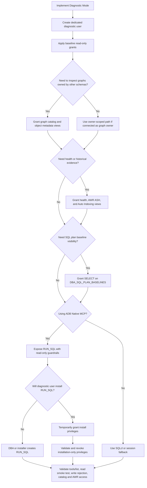

# Diagnostic Mode - Minimum Prerequisites

Purpose: define the minimum database, MCP, privilege, and validation
requirements to run the Graph DBA Advisor in **Diagnostic Mode**.

Scope: read-only analyze/propose mode on Oracle Autonomous Database Serverless
23ai/26ai using ADB Native MCP.

Out of scope: automated remediation, schema creation, data generation,
Consultive Mode, and SQLcl runtime setup.

## Required profile

| Area | Requirement | Required |
|---|---|---|
| Database | Autonomous Database Serverless 23ai or 26ai | Yes |
| MCP | ADB Native MCP endpoint enabled | Yes |
| Runtime user | One dedicated technical database user per target database | Yes |
| Runtime tool | One read-only MCP SQL tool named `RUN_SQL` | Yes |
| Authentication | OAuth or bearer token for the MCP client | Yes |
| Diagnostic access | Direct read grants on performance, graph catalog, health, AWR, and ASH views | Yes |
| Runtime writes | No DDL, DML, PL/SQL, or admin tool exposure | Yes |
| AWR/ASH | Access approved for historical diagnosis | Yes |

Primary requirement detail:

- [docs/graph-dba-workload-mode-requirements.md](graph-dba-workload-mode-requirements.md)

Interactive selector:

- [docs/diagnostic-requirements-selector.html](diagnostic-requirements-selector.html)

GitHub repository preview shows HTML source. For interactive use, open the file
locally or publish `docs/` through GitHub Pages.

Preferred setup assets:

- [clients/adb-diagnostic-user-minimal.sql](../clients/adb-diagnostic-user-minimal.sql)
- [clients/adb-diagnostic-grants-advisor.sql](../clients/adb-diagnostic-grants-advisor.sql)
- [clients/adb-native-run-sql-readonly.sql](../clients/adb-native-run-sql-readonly.sql)
- [clients/adb-mcp-setup.md](../clients/adb-mcp-setup.md)

## Runtime identity

Create one database user for the skill in each target database.

| Property | Requirement |
|---|---|
| Example placeholder | `graph_diag_user` |
| User type | Technical, non-personal |
| Admin account | Do not use `ADMIN` |
| Scope | One target database |
| Ownership | Does not need to own application graph objects |
| Grants | Least-privilege direct grants |
| Operations | Rotatable, auditable, owned by the DBA/admin team |

The same skill can point to multiple databases. Keep the same `RUN_SQL` contract
and change only the MCP alias, endpoint, and token per database.

## Access model

| Scenario | Access model |
|---|---|
| ADB Native MCP with stored PL/SQL tool | Use direct grants listed in this document. |
| Session-based SQL only | `SELECT_CATALOG_ROLE` can be used as a compact read model. |
| Packaged Native MCP tools | Do not rely on roles only; definer-rights PL/SQL does not inherit role privileges reliably. |
| Self-installing `RUN_SQL` | Temporarily grant installation privileges, validate, then revoke. |
| Executing remediation | Separate non-production approval and separate elevated grants. |

Compact session-only alternative:

```sql
GRANT CREATE SESSION TO graph_diag_user;
GRANT SELECT_CATALOG_ROLE TO graph_diag_user;
GRANT EXECUTE ON DBMS_XPLAN TO graph_diag_user;
```

Do not use the compact role-only model as the default for ADB Native MCP stored
PL/SQL tools.

## Required grants

A DBA/ADMIN must grant these privileges to the dedicated diagnostic user.

Recommended path: run
[clients/adb-diagnostic-grants-advisor.sql](../clients/adb-diagnostic-grants-advisor.sql)
as the grant script for the baseline Diagnostic Mode setup.

Alternative path: copy the grants in this section and apply them manually through
the client's standard change-management process.

The skill does not grant privileges to itself, and the diagnostic user does not
need grant/admin privileges at runtime.

## Grant decision flow



Grant sets used in the flow:

| Condition | Apply |
|---|---|
| Always | Session, `DBMS_XPLAN`, and dynamic performance views. |
| Graph DBA catalog across schemas | Property graph catalog and object metadata grants. |
| Health, AWR/ASH, Auto Indexing analysis | Health, AWR/ASH, tablespace/temp, and Auto Indexing grants. |
| SQL plan baseline visibility | `SELECT ON DBA_SQL_PLAN_BASELINES`. |
| ADB Native MCP runtime | Expose `RUN_SQL` with read-only guardrails. |
| Diagnostic user self-installs `RUN_SQL` | Temporary `CREATE PROCEDURE` and `DBMS_CLOUD_AI_AGENT` execute; revoke after validation. |

### Session and execution plan access

```sql
GRANT CREATE SESSION TO graph_diag_user;
GRANT EXECUTE ON DBMS_XPLAN TO graph_diag_user;
```

### Dynamic performance views

```sql
GRANT SELECT ON SYS.V_$SQL TO graph_diag_user;
GRANT SELECT ON SYS.V_$SQLSTATS TO graph_diag_user;
GRANT SELECT ON SYS.V_$SQLAREA_PLAN_HASH TO graph_diag_user;
GRANT SELECT ON SYS.V_$SQL_PLAN TO graph_diag_user;
GRANT SELECT ON SYS.V_$SQL_PLAN_STATISTICS_ALL TO graph_diag_user;
GRANT SELECT ON SYS.V_$SQL_SHARED_CURSOR TO graph_diag_user;
GRANT SELECT ON SYS.V_$SQLTEXT TO graph_diag_user;
GRANT SELECT ON SYS.V_$PARAMETER TO graph_diag_user;
GRANT SELECT ON SYS.V_$SESSION TO graph_diag_user;
GRANT SELECT ON SYS.V_$ACTIVE_SESSION_HISTORY TO graph_diag_user;
GRANT SELECT ON SYS.V_$SYSMETRIC_HISTORY TO graph_diag_user;
GRANT SELECT ON SYS.V_$SYSTEM_EVENT TO graph_diag_user;
GRANT SELECT ON SYS.V_$SGASTAT TO graph_diag_user;
GRANT SELECT ON SYS.V_$PGASTAT TO graph_diag_user;
```

### Graph catalog and object metadata

```sql
GRANT SELECT ON DBA_PROPERTY_GRAPHS TO graph_diag_user;
GRANT SELECT ON DBA_PG_ELEMENTS TO graph_diag_user;
GRANT SELECT ON DBA_PG_EDGE_RELATIONSHIPS TO graph_diag_user;
GRANT SELECT ON DBA_TABLES TO graph_diag_user;
GRANT SELECT ON DBA_INDEXES TO graph_diag_user;
GRANT SELECT ON DBA_IND_COLUMNS TO graph_diag_user;
GRANT SELECT ON DBA_TAB_STATISTICS TO graph_diag_user;
GRANT SELECT ON DBA_TAB_COL_STATISTICS TO graph_diag_user;
```

### Health, AWR, ASH, and Auto Indexing

```sql
GRANT SELECT ON DBA_TABLESPACE_USAGE_METRICS TO graph_diag_user;
GRANT SELECT ON DBA_TEMP_FREE_SPACE TO graph_diag_user;
GRANT SELECT ON DBA_AUTO_INDEX_CONFIG TO graph_diag_user;
GRANT SELECT ON DBA_AUTO_INDEX_IND_ACTIONS TO graph_diag_user;
GRANT SELECT ON DBA_AUTO_INDEX_EXECUTIONS TO graph_diag_user;
GRANT SELECT ON DBA_HIST_SNAPSHOT TO graph_diag_user;
GRANT SELECT ON DBA_HIST_SYSMETRIC_SUMMARY TO graph_diag_user;
GRANT SELECT ON DBA_HIST_SYSTEM_EVENT TO graph_diag_user;
GRANT SELECT ON DBA_HIST_PGASTAT TO graph_diag_user;
GRANT SELECT ON DBA_HIST_ACTIVE_SESS_HISTORY TO graph_diag_user;
```

### Optional plan management visibility

Grant this only when the diagnostic scope includes SQL plan baselines:

```sql
GRANT SELECT ON DBA_SQL_PLAN_BASELINES TO graph_diag_user;
```

## ADB Native MCP requirements

Enable the ADB Native MCP endpoint on the target Autonomous Database:

```text
Tag name:  adb$feature
Tag value: {"name":"mcp_server","enable":true}
```

Expose one read-only MCP tool:

| Tool | Requirement |
|---|---|
| Name | `RUN_SQL` |
| Input | SQL text plus pagination parameters |
| Allowed SQL | `SELECT` and `WITH` only |
| Blocked SQL | DDL, DML, PL/SQL, transaction control, SQLcl commands |
| Blocked syntax | Semicolons, comments, `SELECT FOR UPDATE` |
| Blocked packages | Side-effect packages such as `DBMS_CLOUD`, `DBMS_STATS`, `UTL_HTTP`, `UTL_FILE` |
| Output | JSON |

Recommended implementation:

- [clients/adb-native-run-sql-readonly.sql](../clients/adb-native-run-sql-readonly.sql)

Runtime rule: expose only `RUN_SQL` unless another tool has a documented
approval, threat model, and validation test.

## Installation-only privileges

`CREATE PROCEDURE` is not a runtime privilege for Diagnostic Mode.

Preferred lifecycle:

1. A DBA or installer creates or replaces `RUN_SQL` in the diagnostic schema.
2. The runtime user receives only read grants.
3. The MCP tool list is validated before use.

If the diagnostic user must self-install or self-update `RUN_SQL`, grant these
temporarily:

```sql
GRANT CREATE PROCEDURE TO graph_diag_user;
GRANT EXECUTE ON C##CLOUD$SERVICE.DBMS_CLOUD_AI_AGENT TO graph_diag_user;
```

After installation and validation:

```sql
REVOKE CREATE PROCEDURE FROM graph_diag_user;
```

Revoke any other installation-only privileges that are not needed at runtime.

## Authentication

| Mode | Use when | Notes |
|---|---|---|
| OAuth | Interactive operator login is acceptable | Configure the MCP server URL without an `Authorization` header. |
| Bearer token | Headless, automation, or repeatable demo execution | Generate the token with the dedicated technical database user. |

For multi-database use, create one MCP server entry per target database. Keep
the skill and tool contract unchanged.

## Validation checklist

Complete these checks before running the skill.

| Check | Expected result |
|---|---|
| MCP endpoint reachable | MCP client can connect to the ADB endpoint. |
| Tool allowlist | `tools/list` exposes `RUN_SQL` only for the baseline deployment. |
| Runtime identity | `CURRENT_SCHEMA` resolves to the diagnostic tool schema. |
| Read smoke test | `SELECT 1 AS ok FROM dual` returns JSON. |
| Write rejection | `CREATE TABLE`, `DELETE`, or `BEGIN ... END` is rejected by `RUN_SQL`. |
| Performance views | Query against `SYS.V_$SQL` succeeds. |
| Graph catalog | Query against `DBA_PROPERTY_GRAPHS` succeeds. |
| AWR/ASH | Query against `DBA_HIST_SNAPSHOT` and `SYS.V_$ACTIVE_SESSION_HISTORY` succeeds. |

Suggested smoke-test SQL through `RUN_SQL`:

```sql
SELECT SYS_CONTEXT('USERENV','CURRENT_SCHEMA') AS current_schema FROM dual
```

```sql
SELECT COUNT(*) AS sql_count FROM SYS.V_$SQL
```

```sql
SELECT COUNT(*) AS graph_count FROM DBA_PROPERTY_GRAPHS
```

Expected rejection test:

```sql
CREATE TABLE run_sql_should_reject(id NUMBER)
```

## Required inputs before diagnosis

Collect these values before starting the diagnostic prompt:

| Input | Example |
|---|---|
| Target database alias | `prod-graph-east` |
| Environment classification | `production`, `pre-prod`, `clone`, `test` |
| Target schema or graph name | `APP_SCHEMA`, `TX_FRAUD_GRAPH` |
| Workload window | Last 1 hour, last 24 hours, incident timestamp |
| AWR/ASH approval | Approved or not approved |
| MCP server alias | Client-specific alias |

## Operational constraints

- Do not expose broad SQL execution tools without database-side guardrails.
- Do not use `ADMIN` as the runtime identity.
- Do not grant write privileges for analyze/propose mode.
- Do not mix multiple customer databases behind a single shared technical user.
- Do not let the LLM execute remediation in production.

## References

- [docs/graph-dba-workload-mode-requirements.md](graph-dba-workload-mode-requirements.md)
- [clients/adb-mcp-setup.md](../clients/adb-mcp-setup.md)
- [clients/adb-diagnostic-user-minimal.sql](../clients/adb-diagnostic-user-minimal.sql)
- [clients/adb-diagnostic-grants-advisor.sql](../clients/adb-diagnostic-grants-advisor.sql)
- [clients/adb-native-run-sql-readonly.sql](../clients/adb-native-run-sql-readonly.sql)
- [docs/native-mcp-packaged-playbooks.md](native-mcp-packaged-playbooks.md)
