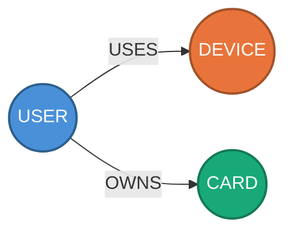

# Color Test

## Test 1 — classDef with ::: on declaration

```mermaid
graph LR
    U((USER)):::v1
    D((DEVICE)):::v2
    C((CARD)):::v3

    U -->|USES| D
    U -->|OWNS| C

    classDef v1 fill:#4A90D9,stroke:#2C5F8A,color:#fff,stroke-width:2px
    classDef v2 fill:#E8743B,stroke:#A3522A,color:#fff,stroke-width:2px
    classDef v3 fill:#19A979,stroke:#127956,color:#fff,stroke-width:2px
```

## Test 2 — class assignment at the end

```mermaid
graph LR
    U((USER))
    D((DEVICE))
    C((CARD))

    U -->|USES| D
    U -->|OWNS| C

    classDef v1 fill:#4A90D9,stroke:#2C5F8A,color:#fff,stroke-width:2px
    classDef v2 fill:#E8743B,stroke:#A3522A,color:#fff,stroke-width:2px
    classDef v3 fill:#19A979,stroke:#127956,color:#fff,stroke-width:2px

    class U v1
    class D v2
    class C v3
```

## Test 3 — style directly on node

```mermaid
graph LR
    U((USER))
    D((DEVICE))
    C((CARD))

    U -->|USES| D
    U -->|OWNS| C

    style U fill:#4A90D9,stroke:#2C5F8A,color:#fff,stroke-width:2px
    style D fill:#E8743B,stroke:#A3522A,color:#fff,stroke-width:2px
    style C fill:#19A979,stroke:#127956,color:#fff,stroke-width:2px
```
