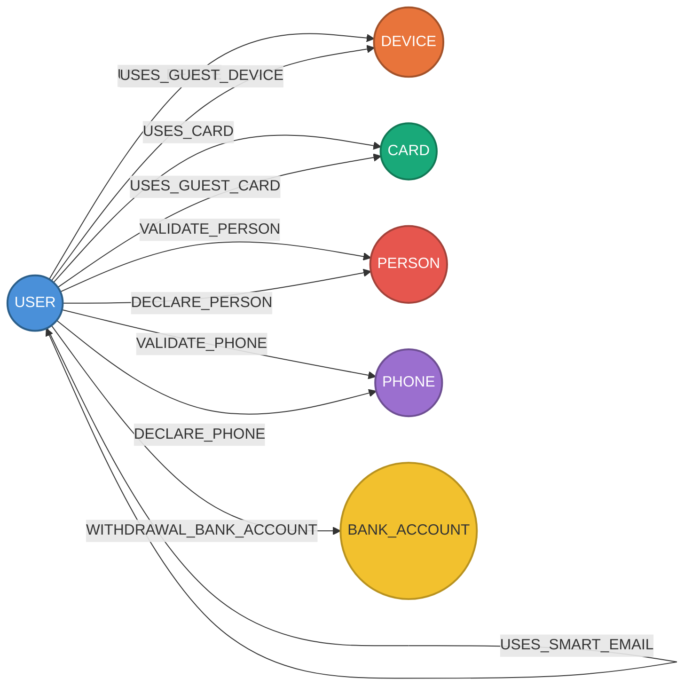

# Fraud Graph — Visual Model

## Graph Topology

## Cardinality (Scale Factor 1)

| Vertex | Rows | Edge | Rows |
|--------|------|------|------|
| USER | ~50K | USES_DEVICE | ~80K |
| DEVICE | ~30K | USES_CARD | ~60K |
| CARD | ~15K | VALIDATE_PERSON | ~50K |
| PERSON | ~8K | DECLARE_PERSON | ~40K |
| PHONE | ~3K | USES_SMART_ID | ~30K |
| BANK_ACCOUNT | ~2K | Others | ~160K |
